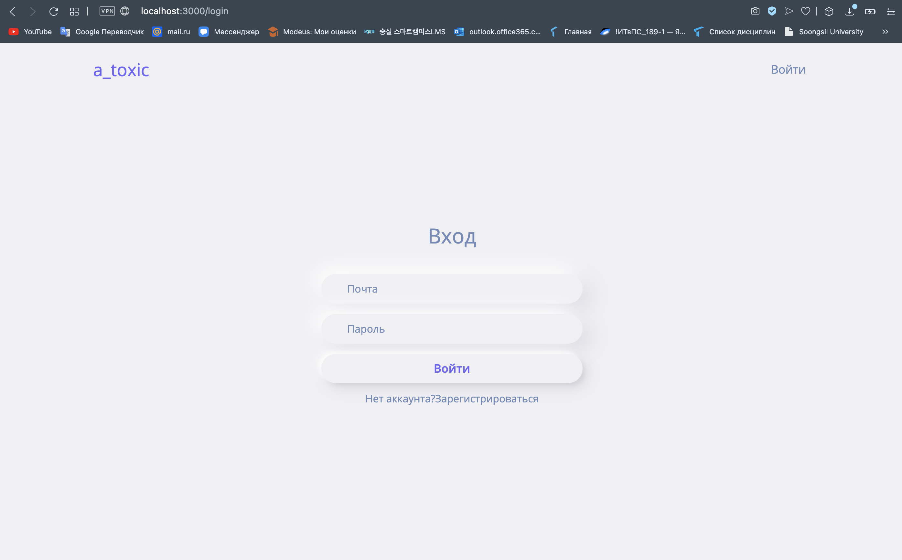
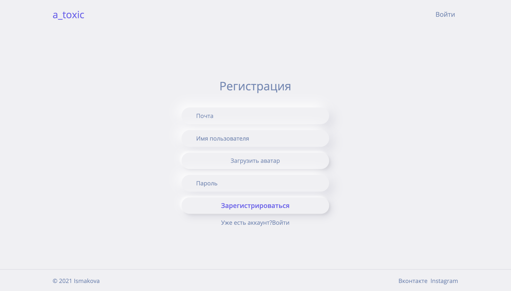
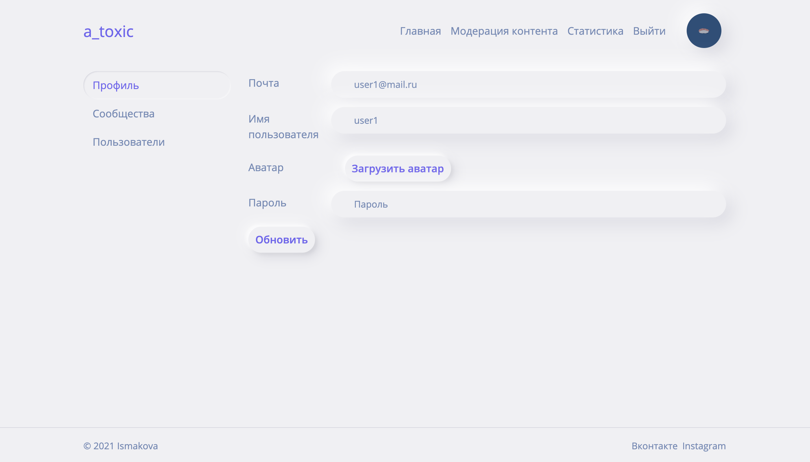
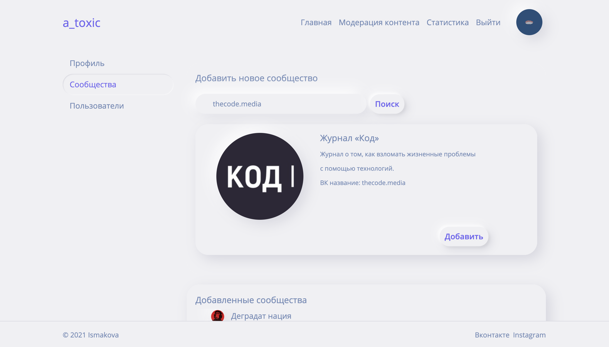
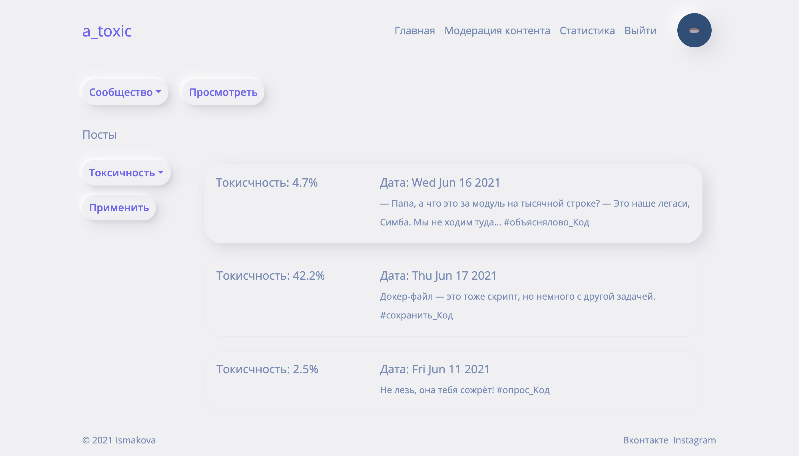
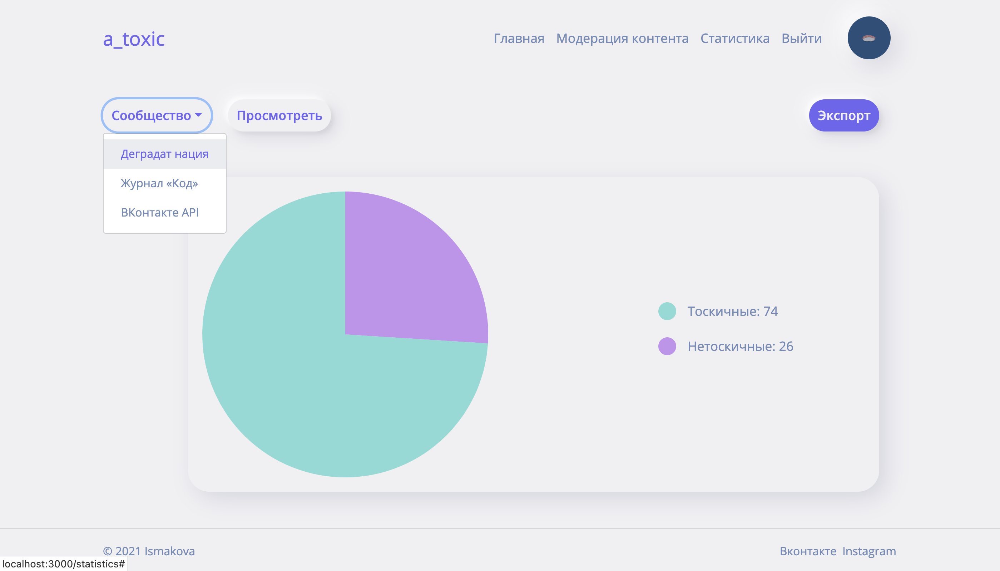

# a_toxic
Проект веб-приложения по модерации контента из соцсети Вконтакте.
## Использованные технологии
### Фреймворки:
* [React](https://ru.reactjs.org)
* [Node.js](https://nodejs.org/en/)
* [Express.js](https://expressjs.com/ru/)
### База данных:
* [PostgresSQL](https://www.postgresql.org)

## Страницы:
### Авторизация

### Регистрация

### Страница пользователя 

### Страница модерации контента

### Страница статистики

